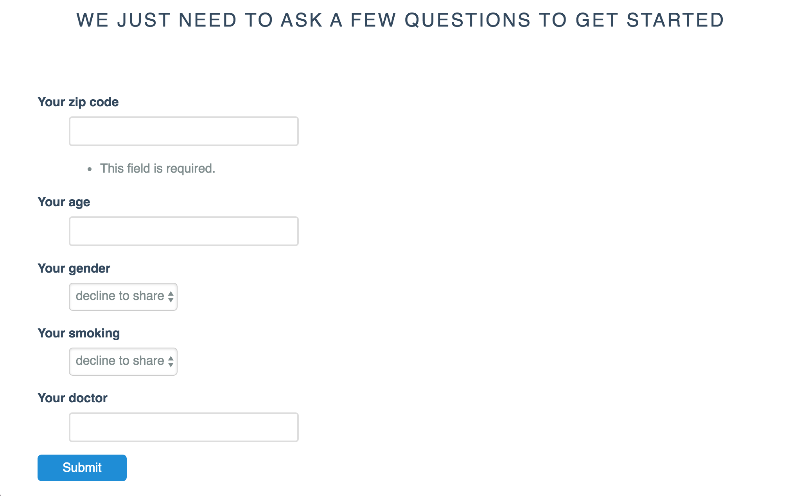

# Bayes Hack 2016 -- Insurance Marketplace for Humans

This project aims to relieve American's frustrations with insurance marketplaces by making it easy to find plans that cover their needs in a transparent and easy to understand way.

We identified three primary sources of frustration:

## 1. Confusion

Insurance plans are confusing. They have a lot of information about what is covered, how, and by whom. Our data show that the average shopper has to contend with 53 separate choices, often in formats that are hard to navigate. To make matters worse, presenting too many options to a purchaser reduces their happiness with whichever insurance option they end up taking.

To solve this problem, we created a simple website.

* It only asks ten questions
* It only gives five options
* It only has one page

## 2. Complexity

Insurance plans are complex. They have copays, adjustments, deductibles, and fees, and may or may not include the doctor you want, the services you want, or facilities that are close to your house. We match your needs with insurance plans that give you everything you want and nothing more.

## 3. Cost

Insurance plans are expensive. What's worse is that it's often hard to understand how and where those expenses come from. What will you pay if you never get sick? Or if you end up in the hospital many times? We developed an algorithm that predicts how much each insurance plan will cost someone like you, on average, so that we can present you with just one number.
